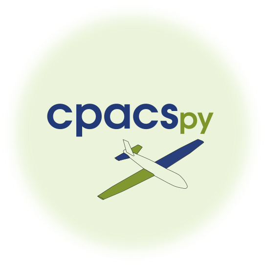

[](https://pypi.python.org/pypi/cpacspy)
[](https://github.com/cfsengineering/cpacspy/actions/workflows/ubuntu.yml)
[](https://codecov.io/gh/cfsengineering/cpacspy)
[](https://github.com/cfsengineering/cpacspy/blob/main/LICENSE.txt)
[](https://github.com/psf/black)

# cpacspy



`cpacspy` is a Python package which could be used to read, write and analyse [CPACS](https://www.cpacs.de/) aerodynamics data. It simplify the handling of AeroMaps.

CPACS is a *Common Parametric Aircraft Configuration Schema*. It is a data definition for the air transportation system which is developed by the German Aerospace Center [DLR](https://www.dlr.de/). CPACS enables engineers to exchange information between their tools.

AeroMaps contains aerodynamic coefficients and derivatives for a specific set of aerodynamic and configurative boundary conditions.

## Installation

`cpacspy` depend mainly in DLR libraries [TIXI](https://github.com/DLR-SC/tixi) and [TIGL](https://github.com/DLR-SC/tigl), they must be installed on your computer to use `cpacspy`. The easiest way to do so, is to use a Conda environment, to create one:

- Install [Anaconda](https://anaconda.org/) or [Miniconda](https://docs.conda.io/en/latest/miniconda.html) if you don't already have one of them installed.

- Clone this repository and create a Conda environment with the following commands:

```bash
git clone https://github.com/cfsengineering/cpacspy.git
cd cpacspy
conda env create -f environment.yml
conda activate cpacspy_env
```

- When it is done or if you already have TIXI and TIGL install on your computer:

```bash
pip install cpacspy
```

## How to use this package

To see how to use this module, check out:

- Python file with examples of useage:  [cpacspy_use.py](./examples/cpacspy_use.py)
- Jupyter Notebook with examples of useage: [cpacspy_use.ipynb](./examples/cpacspy_use.ipynb)

## For developers

### To build and install locally

```bash
cd cpacspy
python -m build
pip install --user .
```

### To run tests locally

```bash
cd cpacspy
./run_ci.sh
```

It should run:

- Black
- Flake8
- Pytest
- Codecov

## License

**License:** [Apache-2.0](./LICENSE.txt)
